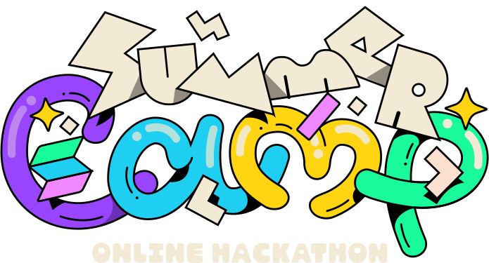

<!-- Improved compatibility of back to top link: See: https://github.com/othneildrew/Best-README-Template/pull/73 -->

<a name="readme-top"></a>

<!--
*** Thanks for checking out the Best-README-Template. If you have a suggestion
*** that would make this better, please fork the repo and create a pull request
*** or simply open an issue with the tag "enhancement".
*** Don't forget to give the project a star!
*** Thanks again! Now go create something AMAZING! :D
-->

<!-- PROJECT SHIELDS -->
<!--
*** I'm using markdown "reference style" links for readability.
*** Reference links are enclosed in brackets [ ] instead of parentheses ( ).
*** See the bottom of this document for the declaration of the reference variables
*** for contributors-url, forks-url, etc. This is an optional, concise syntax you may use.
*** https://www.markdownguide.org/basic-syntax/#reference-style-links
-->

[![Contributors][contributors-shield]][contributors-url]
[![Forks][forks-shield]][forks-url]
[![Stargazers][stars-shield]][stars-url]
[![Issues][issues-shield]][issues-url]
[![MIT License][license-shield]][license-url]
[![LinkedIn][linkedin-shield]][linkedin-url]

<!-- PROJECT LOGO -->
<br />
<div align="center">
  <a href="https://solana.com/summercamp">
    
  </a>

<h3 align="center">devent</h3>

  <p align="center">
    A decentralized event management and ticketing application
    <!-- <br />
    <a href="https://github.com/Niceural/devent"><strong>Explore the docs »</strong></a>
    <br /> -->
    <br />
    <a href="https://youtube.com/">View Demo</a>
    ·
    <a href="https://github.com/Niceural/devent/issues">Report Bug</a>
    ·
    <a href="https://github.com/Niceural/devent/issues">Request Feature</a>
  </p>
</div>

<!-- TABLE OF CONTENTS -->
<details>
  <summary>Table of Contents</summary>
  <ol>
    <li>
      <a href="#about-the-project">About The Project</a>
      <ul>
        <li><a href="#built-with">Built With</a></li>
      </ul>
    </li>
    <li>
      <a href="#getting-started">Getting Started</a>
      <ul>
        <li><a href="#prerequisites">Prerequisites</a></li>
        <li><a href="#installation">Installation</a></li>
      </ul>
    </li>
    <li><a href="#usage">Usage</a>
      <ul>
        <li><a href="#create-a-new-event">Create a new event</a></li>
        <li><a href="#register-for-an-event">Register for an event</a></li>
      </ul> 
    </li>
    <li><a href="#roadmap">Roadmap</a></li>
    <li><a href="#contributing">Contributing</a></li>
    <li><a href="#license">License</a></li>
    <li><a href="#contact">Contact</a></li>
    <li><a href="#acknowledgments">Acknowledgments</a></li>
  </ol>
</details>

<!-- ABOUT THE PROJECT -->

## About The Project

<!-- screenshots -->

This project consists in a decentralized application where users can create events, register to events, and more. It can be considered as a dummy web3 implementation of [eventbrite](https://www.eventbrite.co.uk/). The program (or smart contract) is deployed on [Solana](https://solana.com/) devnet. It has been submitted for examination by the [Solana Summer Camp Hackathon](https://solana.com/summercamp) judges. This project implements the following features:

- an organizer can create a new event,
- a wallet can register to an event (and pay in SOL if the ticket is not free),
- a wallet can confirm attendance to an event,
- a wallet can receive an NFT on registration and/or on attendance to the event,
- an organizer can choose to allow a wallet to resell its ticket and set a maximum resell price,

<p align="right">(<a href="#readme-top">back to top</a>)</p>

### Built With

- [Next.js](https://nextjs.org/)
- [React](https://reactjs.org/)
- [IPFS](https://ipfs.tech/)
- [Pinata](https://www.pinata.cloud/)
- [Tailwindcss](https://tailwindcss.com/)
- [Anchor](https://www.anchor-lang.com/)
- [Solana](https://solana.com/)
- [Metaplex](https://docs.metaplex.com/)

<p align="right">(<a href="#readme-top">back to top</a>)</p>

<!-- GETTING STARTED -->

## Getting Started

In this section we will discuss how to setup and run this project's frontend locally.

### Prerequisites

Project prerequisites and links to how to install them:

- [Node.js](https://nodejs.org/en/download/)
- [npm](https://docs.npmjs.com/downloading-and-installing-node-js-and-npm)
- [yarn](https://classic.yarnpkg.com/en/docs/install#debian-stable)
- [git](https://git-scm.com/downloads)
- [Phantom wallet](https://phantom.app/)

### Installation

1. Clone the repo

   ```sh
   $ git clone https://github.com/Niceural/devent.git
   $ cd devent/devent-frontend/
   ```

2. Install NPM packages
   ```sh
   $ yarn
   ```
3. Create a [Phantom wallet](https://phantom.app/) in your browser
4. Get some devnet SOL by pasting your public key in a SOL [faucet](https://solfaucet.com/)

<!-- 3. Create an account and create a new Pinata API key at [this](https://app.pinata.cloud/keys) link
3. Create a [.env](./devent-frontend/.env) file and enter your API and API secret keys following [.env.example](./devent-frontend/.env.example) template:
   ````sh
   touch .env
   ``` -->

<p align="right">(<a href="#readme-top">back to top</a>)</p>

<!-- USAGE EXAMPLES -->

## Usage

### Create a new event

### Register for an event

### At the gates of Ed Sheeran's concert, how to check if someone has a ticket?

The ticket verification process needs to meed the following requirements:

- speed: in the case of long queues, verifying a ticket should be as quick as scanning a QR Code and shouldn't involve human eyes;
-

<p align="right">(<a href="#readme-top">back to top</a>)</p>

<!-- ROADMAP -->

## Roadmap

- [ ] README
- [ ] youtube presentation video
- [ ] program
  - [x] create state
  - [x] create event
  - [ ] register to event
  - [ ] ticket reselling
  - [ ] confirm attendance
  - [ ] mint nft on registration
  - [ ] mint nft on attendance confirmation
- [ ] sdk
  - [ ] create event
  - [ ] create registration
  - [ ] resell registration
  - [ ] confirm attendance
- [ ] frontend
  - [ ] home page
    - [ ] styling
    - [ ] display some events
  - [ ] create a new event page
    - [ ] styling
    - [ ] create a new event form
    - [ ] display created event
  - [ ] all events page
    - [ ] styling
    - [ ] display all events
    - [ ] event component
  - [ ] register for event page
    - [ ] styling
    - [ ] registration form

See the [open issues](https://github.com/Niceural/devent/issues) for a full list of proposed features (and known issues).

<p align="right">(<a href="#readme-top">back to top</a>)</p>

<!-- CONTRIBUTING -->

## Contributing

Contributions are what make the open source community such an amazing place to learn, inspire, and create. Any contributions you make are **greatly appreciated**.

If you have a suggestion that would make this better, please fork the repo and create a pull request. You can also simply open an issue with the tag "enhancement".
Don't forget to give the project a star! Thanks again!

1. Fork the Project
2. Create your Feature Branch (`git checkout -b feature/AmazingFeature`)
3. Commit your Changes (`git commit -m 'Add some AmazingFeature'`)
4. Push to the Branch (`git push origin feature/AmazingFeature`)
5. Open a Pull Request

<p align="right">(<a href="#readme-top">back to top</a>)</p>

<!-- LICENSE -->

## License

Distributed under the MIT License. See [LICENSE.txt](./LICENSE.txt) for more information.

<p align="right">(<a href="#readme-top">back to top</a>)</p>

<!-- CONTACT -->

## Contact

Nicolas Bayle - [@Niceural](https://twitter.com/Niceural) - nicolas.bayle20@imperial.ac.uk

Project Link: [https://github.com/Niceural/devent](https://github.com/Niceural/devent)

<p align="right">(<a href="#readme-top">back to top</a>)</p>

<!-- ACKNOWLEDGMENTS -->

## Acknowledgments

- [Build Facebook 3.0 on Blockchain with Solana | Next.js | Netlify | Sanity.io](https://youtu.be/8v5lFscLPRY)
- [Build TikTok Web 3.0 Blockchain App with Solana | Rust | Next.js | Netlify](https://youtu.be/qIGs3XWybgU)
- [Coding & Crypto](https://www.youtube.com/c/CodingCrypto)
- [Metaplex](https://docs.metaplex.com/)
- [Solana cookbook](https://solanacookbook.com/)
- [Solana Blockchain Developer Bootcamp 2022](https://chain.link/bootcamp/solana-2022-on-demand)
- [Eventbrite](https://www.eventbrite.co.uk/)

<p align="right">(<a href="#readme-top">back to top</a>)</p>

<!-- MARKDOWN LINKS & IMAGES -->
<!-- https://www.markdownguide.org/basic-syntax/#reference-style-links -->

[contributors-shield]: https://img.shields.io/github/contributors/Niceural/devent.svg?style=for-the-badge
[contributors-url]: https://github.com/Niceural/devent/graphs/contributors
[forks-shield]: https://img.shields.io/github/forks/Niceural/devent.svg?style=for-the-badge
[forks-url]: https://github.com/Niceural/devent/network/members
[stars-shield]: https://img.shields.io/github/stars/Niceural/devent.svg?style=for-the-badge
[stars-url]: https://github.com/Niceural/devent/stargazers
[issues-shield]: https://img.shields.io/github/issues/Niceural/devent.svg?style=for-the-badge
[issues-url]: https://github.com/Niceural/devent/issues
[license-shield]: https://img.shields.io/github/license/Niceural/devent.svg?style=for-the-badge
[license-url]: https://github.com/Niceural/devent/blob/master/LICENSE.txt
[linkedin-shield]: https://img.shields.io/badge/-LinkedIn-black.svg?style=for-the-badge&logo=linkedin&colorB=555
[linkedin-url]: https://linkedin.com/in/nicolas-bayle-558a21200
